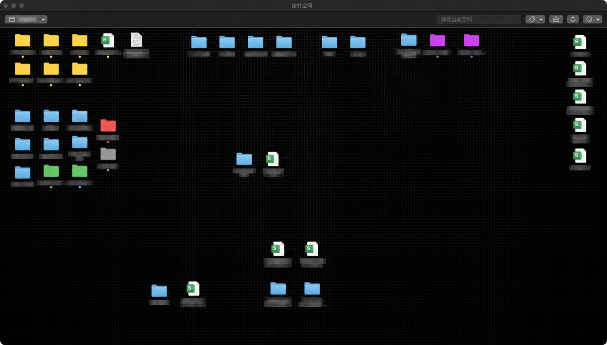
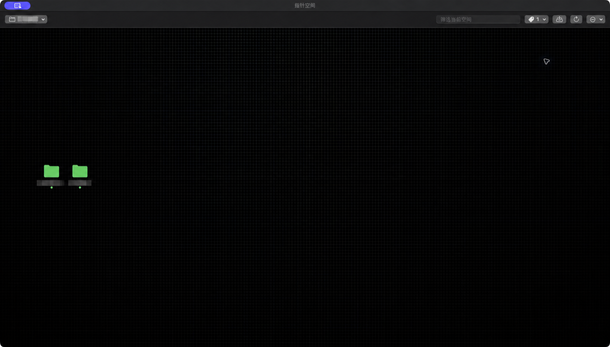
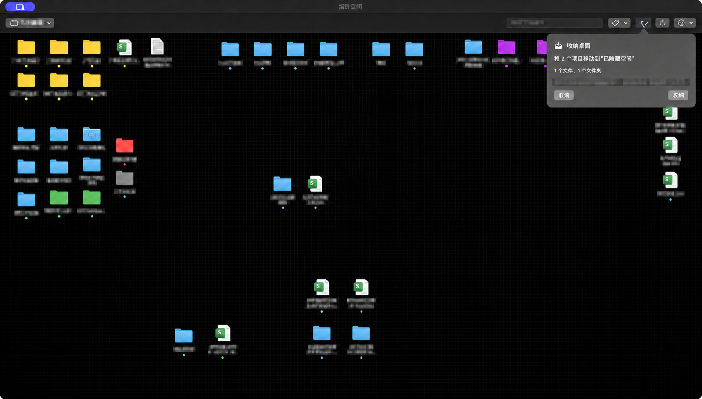

# 指针空间 Pointer Space

> 用位置记住文件。

指针空间是一款轻量、原生的 macOS 空间文件画布。选择一个真实文件夹，它会把第一级文件和子文件夹显示在稳定画布上；你可以像整理桌面一样摆放，之后依靠位置快速找到它们。

[](https://github.com/DingJia87/spatial-folder/releases/latest)
[](Package.swift)
[](https://github.com/DingJia87/spatial-folder/actions/workflows/ci.yml)

当前正式版本：**v5.1.0**

## 界面预览



真实文件保持原位，画布只记录显示位置。公开截图来自日常使用画布，文件名与空间名称已做不可逆遮挡。

| Finder 标签筛选 | 收纳桌面确认 |
| --- | --- |
|  |  |
| 按 Finder 标签颜色快速缩小范围，不改变原有布局。 | 先显示项目数、文件数、文件夹数和目标空间，确认前绝不移动。 |

### 全局快捷唤醒


默认按 `⌃⌥空格`显示指针空间；再次按下即可隐藏，不需要辅助功能或输入监控权限。

## 下载

从 [GitHub Releases](https://github.com/DingJia87/spatial-folder/releases/latest) 下载页面标记为“指针空间.zip（正式安装包）”的 `Pointer-Space.zip`。

1. 解压 ZIP，把 `指针空间.app` 拖入“应用程序”。
2. 首次启动时右键 App，选择“打开”。
3. 选择一个文件夹，建立它自己的空间画布。

系统要求：macOS 14 Sonoma 或更高版本、Apple Silicon Mac。当前公开包使用 ad-hoc 本地签名，尚未进行 Apple Developer ID 公证。

## 为什么使用指针空间

- **位置稳定**：每个文件夹拥有独立布局，重新打开仍保持原位。
- **真实文件**：画布直接对应磁盘内容，不创建替身链接或展示副本。
- **快速唤醒**：默认按 `⌃⌥空格` 显示，再按一次隐藏。
- **轻量运行**：不建立全文索引，不上传文件，不包含账户、云同步或遥测。
- **熟悉操作**：支持 Finder 标签、网格吸附、多选、右键菜单、壁纸和废纸篓。

## 核心功能

### 空间定位

- 只展示所选文件夹的第一级内容，避免递归层级干扰空间记忆。
- 自由摆放图标并持久保存位置、图标大小和文字大小。
- 在“布局历史”中按时间预览、比较并恢复任意布局备份；恢复布局不会恢复或改动真实文件。
- 新文件进入可预测位置，不会重新排列已有内容。
- 搜索可与 Finder 标签颜色组合筛选；超过主画布容量的项目进入独立待放置区。
- 每个显示器使用同一逻辑画布，切换屏幕不会改写坐标。

### 真实文件操作

- 文件使用 macOS 默认应用打开，文件夹在 Finder 中打开。
- 支持重命名、复制、剪切、粘贴、副本、压缩、分享、简介和 Finder 标签。
- 删除会把真实项目移入 macOS 废纸篓。
- 长文件操作在后台串行执行，包含进度、事务记录、冲突确认和撤销/重做。
- “收纳桌面”会先显示文件数、文件夹数和目标空间；确认前绝不移动文件。

### 外观与入口

- 支持系统桌面壁纸、自定义壁纸及浅色/深色外观。
- 菜单栏提供显示/隐藏、最近空间、收纳桌面和快捷键设置。
- 窗口隐藏、关闭或最小化时暂停标签轮询；重新显示时立即同步。

## 文件安全

指针空间把文件系统视为唯一真实数据源。拖动画布图标只修改布局元数据，不会移动真实文件；重命名、粘贴、收纳和废纸篓等命令会明确作用于磁盘。布局与操作记录保存在固定的 `Application Support/SpatialFolder` 目录，升级到“指针空间”后继续沿用，无需迁移。

详细规则见[用户指南](docs/USER_GUIDE.md)和[隐私说明](docs/PRIVACY.md)。

## 开发

技术栈：SwiftUI、AppKit、Foundation、Swift Package Manager。

```zsh
./scripts/run_dev.zsh
./scripts/run_standard_tests.zsh
./scripts/run_self_tests.zsh
./scripts/run_performance_baseline.zsh
./scripts/package_app.zsh
```

5.0 包含 18 项标准测试和 71 项完整自测。CI 会执行测试及严格 Release 构建。

## 文档与支持

- [用户指南](docs/USER_GUIDE.md)
- [当前状态](docs/CURRENT_STATUS.md)
- [版本记录](CHANGELOG.md)
- [5.0 发布说明](docs/releases/RELEASE_NOTES_5.0.md)
- [隐私说明](docs/PRIVACY.md)
- [支持与反馈](docs/SUPPORT.md)
- [安全政策](SECURITY.md)
- [开发文档索引](docs/README.md)

## 当前边界

- 只展示直接子项目；文件夹不会在 App 内继续展开。
- 第三方 Finder 扩展菜单不能保证复制，可使用“在 Finder 中显示”。
- 尚未处理 iCloud 多设备同时修改同一画布的冲突。
- 当前没有 Developer ID 签名和公证。
